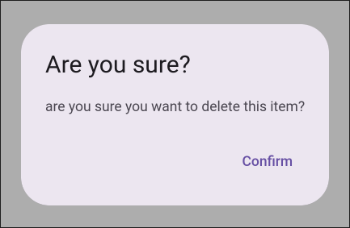

# Material 3 Prompt Dialog

Small prompt dialog utility function written in Material-web 3



## Installation

```bash
npm add -D material-3-prompt-dialog
```

## Usage

```typescript
import {prompt} from 'material-3-prompt-dialog';

try {
	await prompt({
		headline: 'Are you sure?',
		content: 'are you sure you want to delete this item?',
		{/* confirm button options */},
	})
	// was confirmed, do something...
} catch (_) {
	// was canceled
}
```

### Dialog options

```typescript
{
	/**
	 * Headline of the dialog.
	 */
	headline?: string;
	/**
	 * Content of the dialog.
	 */
	content: string | TemplateResult;
	/**
	 * Confirm button options.
	 */
	confirmButton?: PromptButton;
	/**
	 * Cancel button options.
	 */
	cancelButton?: PromptButton;
}
```

### Button options

```typescript
{
	/**
	 * The label of the button.
	 */
	label?: string;
	/**
	 * The dialog action that the button emits when clicked.
	 */
	dialogAction?: string;
	/**
	 * Option callback to execute when the button is clicked.
	 * @param {MdDialog} dialog dialog host
	 * @returns void
	 */
	callback?: (dialog: MdDialog) => void;
	/**
	 * The default tagname to be used for the button.
	 * @default 'md-text-button'
	 */
	buttonType?: string;
}
```
